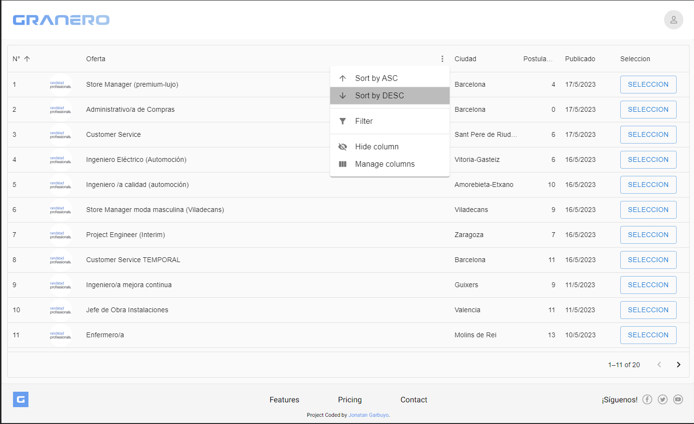
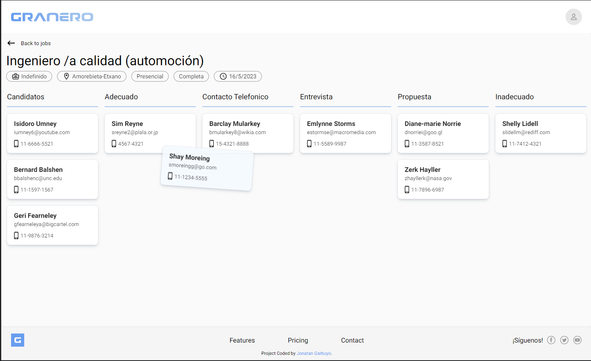

# Granero - InfoJobs hackathon

## Tabla de contenido

- [Cómo participar](#cómo-participar)
  - [Premios](#🎁-premios)
  - [Requerimientos](#👀-requerimientos)
  - [Recursos](#📦-recursos)
  - [Votaciones](#🗳️-votaciones)
  - [Preguntas frecuentes](#💬-preguntas-frecuentes)
- [Mi solución](#mi-solución)
  - [Screenshot](#screenshot)
  - [Links](#links)
- [Mi proceso](#mi-proceso)
  - [Construido con](#construido-con)
- [Author](#author)

## Cómo participar

- Crea un proyecto que tenga que ver con Infojobs.
- Deja tu proyecto en [este](https://tally.so/r/wMD58p) formulario.
- Deja tu proyecto en este hilo: ⁠🔥┃infojobs-hackathon⁠

⚠️ FECHA MÁXIMA DE ENTREGA: 30 mayo 23:59:59 CET

## 🎁 Premios

### Primer puesto

iPad 10ª generación o PlayStation 5 (a elegir uno)

### Segundo puesto

Nintendo Switch o Air Pods normales (a elegir uno)

### Tercer puesto

Auriculares de Sony WF-1000XM4 o Teclado Keychron a elegir hasta 100€ (a elegir uno)

### Por participar

Swag Pack de Infojobs para residentes en España
Libro digital de midudev para LATAM

Importante: Si no se puede enviar el premio, se hará el pago por el importe del producto (precio España convertido a la moneda del país o dólares).

## 👀 Requerimientos

- El proyecto tiene que estar subido a GitHub y ser de código abierto.
- Debe estar desplegado en algún hosting para poder probarse fácilmente

## 📦 Recursos

(uso opcional pero valorable)

UI Figma Kits: [link](https://www.figma.com/community/file/1239958249701816228)  
Acceso a la API de InfoJobs: [link](https://developer.infojobs.net/)

## 🗳️ Votaciones

El equipo de Infojobs hará una selección de los mejores proyectos y haremos una votación pública el 1 de junio en Twitch.

## 💬 Preguntas frecuentes

- ¿Se pueden hacer equipos?  
  Sí. Pero sólo es un premio/swag por equipo.
- ¿Se puede usar X tecnología?  
  Sí, podéis usar la tecnología que queráis.
- ¿Podéis utilizar otras APIs?  
  Sí, pero como mínimo tienes que usar la API de Infojobs.
- ¿Hay mínimo de tamaño o funcionalidad?  
  Sí, como mínimo tiene que usar la API de Infojobs y resolver algún problema o añadir una funcionalidad.
- ¿Qué criterios se siguen para valorar proyectos?  
  Solucionar un problema de usuarios, Creatividad, Buena presentación y Buen Código.
- ¿Puede ser app móvil?  
  Sí, pero se tiene que poder probar FÁCIL.
- ¿Es internacional?  
  Sí, puede participar TODO EL MUNDO.

Mas info en : https://discord.gg/midudev?event=1096400010142306356

## Mi solución

Para este hackathon realicé un administrador de ofertas laborales.
En él se puede ver, filtrar y ordenar las ofertas publicadas por el reclutador.
Tambien, cuenta con una vista detallada de la oferta en la cual organizar el estado de la candidatura de cada postulante mediante un tablero Kanban con drag and drop.

### Screenshots

  

### Links

- Solucio URL: [github](https://github.com/JonatanGarbuyo/infojobs-hackathon)
- Sitio URL: [vercel](https://infojobshackathon.vercel.app/)

## Mi Proceso

### Construido con

- Material UI Grids
- DnD-Kit
- Next.js 13
- CSS custom properties
- Flexbox
- CSS Grid

## Author

- Github - [Jonatan Garbuyo](https://github.com/JonatanGarbuyo)
- Linkedin - [@JonatanGarbuyo](https://www.linkedin.com/in/jonatan-garbuyo/)
